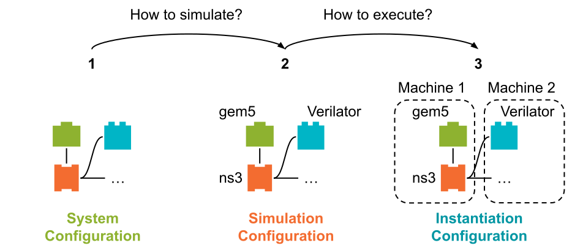

..
  Copyright 2026 Max Planck Institute for Software Systems,
  National University of Singapore, and SimBricks UG (haftungsbeschraenkt)
..
  Permission is hereby granted, free of charge, to any person obtaining
  a copy of this software and associated documentation files (the
  "Software"), to deal in the Software without restriction, including
  without limitation the rights to use, copy, modify, merge, publish,
  distribute, sublicense, and/or sell copies of the Software, and to
  permit persons to whom the Software is furnished to do so, subject to
  the following conditions:
..
  The above copyright notice and this permission notice shall be
  included in all copies or substantial portions of the Software.
..
  THE SOFTWARE IS PROVIDED "AS IS", WITHOUT WARRANTY OF ANY KIND,
  EXPRESS OR IMPLIED, INCLUDING BUT NOT LIMITED TO THE WARRANTIES OF
  MERCHANTABILITY, FITNESS FOR A PARTICULAR PURPOSE AND NONINFRINGEMENT.
  IN NO EVENT SHALL THE AUTHORS OR COPYRIGHT HOLDERS BE LIABLE FOR ANY
  CLAIM, DAMAGES OR OTHER LIABILITY, WHETHER IN AN ACTION OF CONTRACT,
  TORT OR OTHERWISE, ARISING FROM, OUT OF OR IN CONNECTION WITH THE
  SOFTWARE OR THE USE OR OTHER DEALINGS IN THE SOFTWARE.

.. _sec-abstractions:

Abstractions
==============================

Virtual Prototype Scripts
------------------------------

With SimBricks, users **define their virtual prototypes programmatically through Python scripts** using the SimBricks :ref:`Orchestration Framework <sec-orchestration-framework>`.
In order to write these Python scripts, SimBricks provides a :ref:`python package <sec-orchestration-framework-ref>`.
This package provides an intuitive and flexible API that allows to easily configure virtual prototypes in Python.
Concrete device models and simulators are provided by additional per-simulator *component packages* under the shared ``simbricks.components.*`` namespace (see :ref:`sec-orchestration-framework-components`).

The package is structured into **three key parts** reflecting SimBricks' distinct configuration abstractions: **System-, Simulation- and Instantiation-Configuration**.
As a result, user scripts typically follow a three-part structure to configure and instantiate virtual prototypes seamlessly.

.. _concepts-fig-vp-scripts:

  Conceptual Overview over the SimBricks Abstractions to configure Virtual Prototypes

This configuration model introduces a **clear separation of concerns** to streamline the process of defining, simulating, and instantiating virtual prototypes (as shown in :numref:`concepts-fig-vp-scripts`):

1. **System Configuration** - *What does the virtual prototype look like?*

   The first step of configuring a virtual prototype is the creation of a system configuration that describes all components and their respective properties.
   Importantly, this step is **independent of any specific simulators**.
   You are simply building a conceptual model of the system—its components, their connections, and their attributes—without worrying about how they will be simulated.

   This step should lead to a generic blueprint of your system, which can be reused in various simulations using potentially different simulators.

   In :numref:`concepts-code-example-sys-conf` you can see an exemplary system configuration for a system that is composed of a simple network with two machines connected by a switch.
   In this configuration the two machines (e.g., server and client) and their configurations (e.g., CPU cores, software), the network cards for each machine and a switch to connect the two network cards are defined.
   Note how the generic components (``EthSwitch``, applications) come from ``simbricks.orchestration.system``, while the concrete device models (``I40ELinuxHost``, ``IntelI40eNIC``) come from the i40e component package ``simbricks.components.i40e.system``.

.. _concepts-code-example-sys-conf:

.. code-block:: python
  :caption: Example System Configuration of a system composed of two hosts that connect to each other through a switch via their respective NICs.

   from simbricks.orchestration import system
   from simbricks.components.i40e import system as i40e_sys

   syst = system.System()

   # Add a server with a network card
   server = i40e_sys.I40ELinuxHost(syst)
   nic0 = i40e_sys.IntelI40eNIC(syst)
   nic0.add_ipv4("10.0.0.1")
   server.connect_pcie_dev(nic0)

   # Add a client with a network card
   client = i40e_sys.I40ELinuxHost(syst)
   nic1 = i40e_sys.IntelI40eNIC(syst)
   nic1.add_ipv4("10.0.0.2")
   client.connect_pcie_dev(nic1)

   # Add applications and connect components
   server.add_app(system.IperfTCPServer(h=server))
   client.add_app(system.IperfTCPClient(h=client, server_ip=nic0._ip))

   switch = system.EthSwitch(syst)
   switch.connect_eth_peer_if(nic0._eth_if)
   switch.connect_eth_peer_if(nic1._eth_if)

2. **Simulation Configuration** - *How should the system be simulated?*

   In this step, the components defined in the system configuration are mapped to specific simulators to use.
   This is where you **decide which simulator** will handle each component.

   This allows to easily experiment with different simulators or configurations while still simulating the same system.
   You could for example either use lightweight simulators for fast functional testing or use more detailed simulators for performance evaluations.

   Therefore, one can also define multiple simulation configurations for the same system, depending on their (different) use cases.
   The flexibility allows to choose the right trade-offs between simulation speed and accuracy.

   In our example we continue by specifying that the QEMU simulator shall be used for client and server, and behavioral models for the switch and the Intel i40e NICs.
   The simulator classes again come from the respective component packages.
   You can see this in :numref:`concepts-code-example-sim-conf`.

.. _concepts-code-example-sim-conf:

.. code-block:: python
  :caption: Example Simulation Configuration for the :ref:`system <concepts-code-example-sys-conf>` defined above. The hosts are simulated using QEMU, the NICs using an Intel i40e behavioral model and the switch by a behavioral switch simulator.

   from simbricks.orchestration.helpers import simulation as sim_helpers
   from simbricks.components.qemu import simulation as qemu_sim
   from simbricks.components.i40e.simulation import behavioral as i40e_sim
   from simbricks.components.net.simulation import base as net_sim

   sim = sim_helpers.simple_simulation(syst, compmap={
       system.FullSystemHost: qemu_sim.QemuSim,
       i40e_sys.IntelI40eNIC: i40e_sim.I40eNicSim,
       system.EthSwitch: net_sim.SwitchNet,
   })

3. **Instantiation Configuration** - *Where and how should the simulation run?*

   This is the final step, where you configure the **runtime details for the execution** of your virtual prototype.
   This step does not alter the functionality or accuracy of the simulation.

   Therefore, we provide fine-grained control over how your virtual prototypes are run while abstracting away unnecessary complexities for simpler use cases (i.e. by creating a simple single-fragment instantiation via ``inst_helpers.simple_instantiation(sim)``).

   In :numref:`concepts-code-example-inst-conf` we continue with our example from above: we choose to execute the simulators of the client and its network card on one physical machine while executing the simulators for the server, its network card and the switch on another machine.
   For this we assign the simulators created before to different Fragments for execution, and connect the two Fragments through a proxy pair.
   Additionally we specify that the second of those Fragments should be executed on a Runner that has the ``lab1-runner`` tag.

.. _concepts-code-example-inst-conf:

.. code-block:: python
  :caption: Example Instantiation Configuration for the :ref:`system <concepts-code-example-sys-conf>` and :ref:`simulation <concepts-code-example-sim-conf>` defined above. The execution of the simulators is distributed across two machines.

   from simbricks.orchestration import instantiation

   inst = instantiation.Instantiation(sim)

   fragment0 = instantiation.Fragment()
   fragment0.add_simulators(sim.find_sim(server), sim.find_sim(nic0), sim.find_sim(switch))
   fragment1 = instantiation.Fragment(runner_tags={"lab1-runner"})
   fragment1.add_simulators(sim.find_sim(client), sim.find_sim(nic1))
   inst.fragments = [fragment0, fragment1]

   # connect the two fragments through a TCP proxy pair
   proxy_pair = inst.create_proxy_pair(instantiation.TCPProxy, fragment0, fragment1)
   proxy_pair.assign_sim_channel(nic1._eth_if.channel)

   inst.finalize_validate()

.. tip::
  A complete, runnable example of a distributed instantiation can be found in
  `networking-case-study/milestone-5.py <https://github.com/simbricks/simbricks-examples/blob/main/networking-case-study/milestone-5.py>`_
  in the examples repository.

.. note::
  When integrating a new simulator into the SimBricks platform, the new simulator is made available for writing Python scripts through its own component packages that extend the ``simbricks.components.*`` namespace.
  For learning how to do this check out our detailed explanation on :ref:`how to integrate a new simulator <sec-simulator-integration>`.

.. tip::
  If you are interested in more details about the SimBricks orchestration framework check out our chapter on the :ref:`sec-orchestration-framework`.

Adapter
------------------------------

SimBricks Adapters are essential for assembling modular and interoperable simulations in the SimBricks ecosystem.

On a high level, SimBricks Adapters implement interfaces that bridge the communication between different simulators within the SimBricks framework.
They enable the creation of virtual prototypes by combining instances of multiple (heterogeneous-)simulator instances (e.g., CPU simulators, network simulators, or device simulators).
By implementing these interfaces Adapters interact, exchange data and ensure the synchronization of these simulators.

.. note::
  When integrating a new simulator into the SimBricks platform users need to understand and implement an Adapter.

.. tip::
  If you are interested in Adapters and the rationale behind them check out our :ref:`detailed explanation on what Adapters are and how to implement them <sec-simulator-integration>`.
