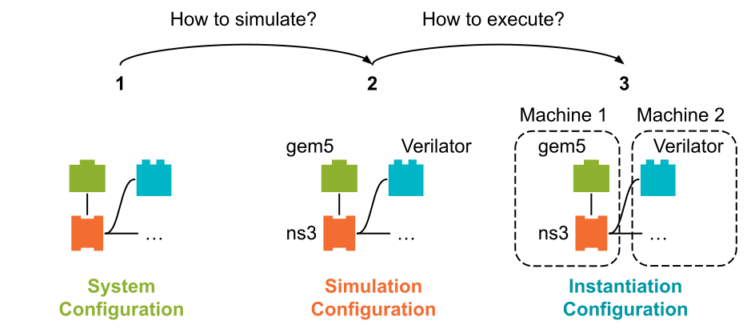

..
  Copyright 2022 Max Planck Institute for Software Systems, and
  National University of Singapore
..
  Permission is hereby granted, free of charge, to any person obtaining
  a copy of this software and associated documentation files (the
  "Software"), to deal in the Software without restriction, including
  without limitation the rights to use, copy, modify, merge, publish,
  distribute, sublicense, and/or sell copies of the Software, and to
  permit persons to whom the Software is furnished to do so, subject to
  the following conditions:
..
  The above copyright notice and this permission notice shall be
  included in all copies or substantial portions of the Software.
..
  THE SOFTWARE IS PROVIDED "AS IS", WITHOUT WARRANTY OF ANY KIND,
  EXPRESS OR IMPLIED, INCLUDING BUT NOT LIMITED TO THE WARRANTIES OF
  MERCHANTABILITY, FITNESS FOR A PARTICULAR PURPOSE AND NONINFRINGEMENT.
  IN NO EVENT SHALL THE AUTHORS OR COPYRIGHT HOLDERS BE LIABLE FOR ANY
  CLAIM, DAMAGES OR OTHER LIABILITY, WHETHER IN AN ACTION OF CONTRACT,
  TORT OR OTHERWISE, ARISING FROM, OUT OF OR IN CONNECTION WITH THE
  SOFTWARE OR THE USE OR OTHER DEALINGS IN THE SOFTWARE.

.. _sec-abstractions:

Abstractions
==============================

Virtual Prototype Scripts
------------------------------

With SimBricks do users **define their virtual prototypes programmatically through python scripts** using the SimBricks :ref:`Orchestration Framework <sec-orchestration-framework>`.
In order to write these python scripts, SimBricks provides a :ref:`python package <sec-orchestration-framework-ref>`.
This package provides an intuitive and flexible API that allows to easily configure virtual prototypes in python.

The package is structured into **three key parts** reflecting SimBricks distinct configuration abstractions: **System-, Simulation- Instantiation-Configuration**.
As a result, user scripts typically follow a three-part structure to configure and instantiate virtual prototypes seamlessly.

.. _concepts-fig-vp-scripts:

  Conceptual Overview Overview over the SimBricks Abstractions to configure Virtual Prototypes 

This configuration model introduces a **clear separation of concerns** to streamline the process of defining, simulating, and instantiating virtual prototypes (as shown in :numref:`concepts-fig-vp-scripts`):

1. **System Configuration** - *What does the virtual prototype look like?*

   This is the first step of configuring a virtual prototype is the creation of a system configuration that describes all components and their respective properties.
   Importantly, this step is **independent of any specific simulators**.
   You are simply building a conceptual model of the system—its components, their connections, and their attributes—without worrying about how they will be simulated.

   This step should lead to a generic blueprint of your system, which can be reused in various simulations using potentially different simulators.

   In :numref:`concepts-code-example-sys-conf` you can see an exemplary system configuration for a system that is ocmposed of a simple network with two machines connected by a switch.
   In this ocnfiguration the two machines (e.g., server and client) and their configurations (e.g., CPU cores, software), the network cards for each machine and a switch to connect the two network cards are defined.
   
.. _concepts-code-example-sys-conf:

.. code-block:: python
  :caption: Example System Configuration of a system composed of two hosts that connect to each other through a switch via their respective NICs.

   syst = system.System()

   # Add a server with a network card
   server = system.I40ELinuxHost(syst)
   nic0 = system.IntelI40eNIC(syst)
   nic0.add_ipv4("10.0.0.1")
   server.connect_pcie_dev(nic0)

   # Add a client with a network card
   client = system.I40ELinuxHost(syst)
   nic1 = system.IntelI40eNIC(syst)
   nic1.add_ipv4("10.0.0.2")
   client.connect_pcie_dev(nic1)

   # Add applications and connect components
   server.add_app(system.IperfTCPServer(h=server))
   client.add_app(system.IperfTCPClient(h=client, server_ip=nic0._ip))

   switch = system.EthSwitch(syst)
   switch.connect_eth_peer_if(nic0._eth_if)
   switch.connect_eth_peer_if(nic1._eth_if)

2. **Simulation Configuration** - *How should the system be simulated?*
   
   In this step, the components defined in the system configuration are mapped to specific simulators to use. 
   This is where you **decide which simulator** will handle each component. 
   
   This allows to easily experiment with different simulators or configurations while still simulating the same system.
   You could for example either use lightweight simulators for fast functional testing or use more detailed simulators for performance evaluations.

   Therefore, one can also define multiple simulation configurations for the same system, depending on their (different) use cases.
   The flexibility allows to choose the right trade-offs between simulation speed and accuracy.

   In our example we continue by specifing that the QEMU simulator shall be used for client and server, a behavioral model of the switch and the Intel I40e NIC.
   You can see this in :numref:`concepts-code-example-sim-conf`.

.. _concepts-code-example-sim-conf:

.. code-block:: python
  :caption: Example Simulation Configuration for the :ref:`system <concepts-code-example-sys-conf>` defined above. The hosts are simulated using QEMU, the NICs using an Intel I40e bahavioral model and the swithc by a behavioral switch simulator. 

   sim = sim_helpers.simple_simulation(syst, compmap={
       system.FullSystemHost: sim.QemuSim,
       system.IntelI40eNIC: sim.I40eNicSim,
       system.EthSwitch: sim.SwitchNet,
   })

3. **Instantiation Configuration** - *Where and how should the simulation run?*
   
   This is the final step, where you configure the **runtime details for the execution** of your virtual prototype.
   This step does not alter the functionality or accuracy of the simulation. 
   
   Therefore, we provide fine-grained control over how your virtual prototypes are run while abstracting away unnecessary complexities for simpler use cases (i.e. by creating a "dummy" instantiation configuration).

   In :numref:`concepts-code-example-inst-conf` we continue with our example from above, we could simply choose to execute the simulators of client and its network card on one physical machine while executing the simulators for server and its network card and the switch on another machine.
   For this we assign the simulators created before to different fragemtns for execution.  
   Additionally we specfify that the second of those fragments should be executed on a Runner that has the ``lab1-runner`` tag.

.. _concepts-code-example-inst-conf:

.. code-block:: python
  :caption: Example Instantiation Configuration for the :ref:`system <concepts-code-example-sys-conf>` and :ref:`simulation <concepts-code-example-sim-conf>` defined above. The execution of the simulators is distributed across two machines. 

   inst = inst_helpers.simple_dist(sim, mapper=lambda s: 1 if s.components()[0] in [client, nic1] else 0)
   inst.get_fragment(1).tags = ['lab1-runner']

.. note::
  When integrating a new simulator into the SimBricks platform users need to extend SimBricks Orchestration Framework package in order to make the new simulator available for writing python scripts.
  For learning how to do this check out our detailed explanation on :ref:`how to integrate a new simulator <sec-simulator-integration>`. 

.. tip::
  If you are interested in more details about the SimBricks orchestration framework check out our chapter on the :ref:`sec-orchestration-framework`.

Adapter
------------------------------

SimBricks Adapters are essential for assembling modular and interoperable simulations in the SimBricks ecosystem.

On a high level, SimBricks Adapters implement interfaces that bridge the communication between different simulators within the SimBricks framework.
They enable the creation of virtual prototypes by combining instances of multiple (heterogeneous-)simulator instances (e.g., CPU simulators, network simulators, or device simulators).
By impementing these interfaces Adapters interact, exchange data and ensure the synchronization of these simulators.

.. note::
  When integrating a new simulator into the SimBricks platform users need to understand and implement an Adapter. 

.. tip::
  If you are interested in Adapters and the rational behind the check out our :ref:`detailed exaplanation on what Adapters are and how to implement them <sec-simulator-integration>`.
