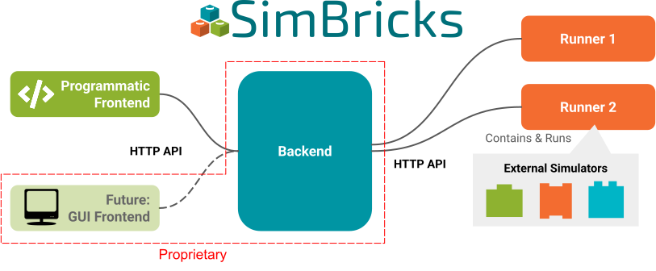

..
  Copyright 2022 Max Planck Institute for Software Systems, and
  National University of Singapore
..
  Permission is hereby granted, free of charge, to any person obtaining
  a copy of this software and associated documentation files (the
  "Software"), to deal in the Software without restriction, including
  without limitation the rights to use, copy, modify, merge, publish,
  distribute, sublicense, and/or sell copies of the Software, and to
  permit persons to whom the Software is furnished to do so, subject to
  the following conditions:
..
  The above copyright notice and this permission notice shall be
  included in all copies or substantial portions of the Software.
..
  THE SOFTWARE IS PROVIDED "AS IS", WITHOUT WARRANTY OF ANY KIND,
  EXPRESS OR IMPLIED, INCLUDING BUT NOT LIMITED TO THE WARRANTIES OF
  MERCHANTABILITY, FITNESS FOR A PARTICULAR PURPOSE AND NONINFRINGEMENT.
  IN NO EVENT SHALL THE AUTHORS OR COPYRIGHT HOLDERS BE LIABLE FOR ANY
  CLAIM, DAMAGES OR OTHER LIABILITY, WHETHER IN AN ACTION OF CONTRACT,
  TORT OR OTHERWISE, ARISING FROM, OUT OF OR IN CONNECTION WITH THE
  SOFTWARE OR THE USE OR OTHER DEALINGS IN THE SOFTWARE.

.. _sec-architecture:

Architectural Overview
==============================

In this chapter we will give an architectural overview over the different pieces of SimBricks.

Currently the SimBricks architecture comprises three main parts: Frontend, Backend and Runners as shown in the figure below. 
In the following we will have an overview over the purpose of these pieces.

  Architectural Overview over the SimBricks Architecture 

Frontend
-------------------------------------------

Users use the SimBricks Frontend to configure virtual prototypes i.e. to define experiments and to trigger the execution of them.

.. note::
  Orchestration Framework, CLI and CLient Library are Open source, the GUI Closed Source. 

The Fontend itself is again composed of multiple important pieces:

* **Python Orchestration Framework:**
  Users configure virtual prototypes through our python :ref:`sec-orchestration-framework`. This means users can write simple python scripts using the
  orchestration framework to define the experiments they want to run including (but not limited to) the simulation topology, simulators and whether the
  simulation should be executed on multiple machines or not.
* **Command-Line Interface (CLI):**
  Once the virtual prototype configurations are ready, users submit them to the backend for execution. This can be done using the SimBricks :ref:`sec-cli-ref`
  tool. Users can opt to asynchronously retrieve the output and results at a later time, or handle themsynchronously as the virtual prototype runs. Besides the
  execution in the cloud SimBricks also supports the local **limited** execution of virtual prototypes locally through the command line.
* **Python Client Library:**
  Instead of sending virtual prototype configurations via the CLI to the backend, users can use our Client Library directly within the python scripts that
  define their virtual prototypes in order to send it to the backend for execution. This does also offer the flexibility to process the results conviniently
  through python scripts.
* **Graphical User Interface (GUI):**
  Looking ahead, we plan to extend SimBricks by introducing a graphical web-based frontend, that enables graphical configuration and interaction with virtual prototypes.

.. 
  Virtual Prototyping Orchestration Framework
  ^^^^^^^^^^^^^^^^^^^^^^^^^^^^^^^^^^^^^^^^^^^
  CLI
  ^^^^^^^^^^^^^^^^^^^^^^^^^^^^^^^^^^^^^^^^^^^
  On-Premise
  ^^^^^^^^^^^^^^^^^^^^^^^^^^^^^^^^^^^^^^^^^^^

Backend
-------------------------------------------

.. note::
  The Backend is Closed Source and hosted by the SimBricks organization. 

The backend in SimBricks serves as the central hub for managing and executing virtual prototype simulations. Its responsibilities include:

* **Storing Configurations and Results:** 
  It securely retains the virtual prototype configurations submitted by users, along with the outputs and results generated during their execution, ensuring
  these can be retrieved at any time in the future.
* **Scheduling Simulations:**
  When multiple users submit virtual prototyping configurations for execution, the backend organizes and schedules them. It determines which virtual prototypes
  run on which runners (execution nodes) and when, efficiently managing the available resources.
* **Aggregating Outputs and Results:**
  After the execution of a virtual prototype finished, the backend collects and consolidates the outputs and results, making them accessible for either
  asynchronous or synchronous processing via the CLI tool or Python client library.

In essence, the backend is the operational core of SimBricks, enabling users to define, execute, and analyze their virtual prototypes seamlessly.

Runners
-------------------------------------------

.. note::
  Runners are Open Source. 

:ref:`sec-runner` are responsible for the actual execution of virtual prototypes. 

Once a user submitted a virtual prototyping configurations for execution to the backend, the backend will schedule its execution on one of the runners that
still has resources available. 

Each runner is setup with a (set of) suitable environment(s) for the simulators it supports, and different runners can be configured differently and independently.
As a result even mutually incompatible simulators can be configured through different runners that can run on shared or separate machines. 

Runners can run on a users infrastructure or can be hosted by the SimBricks organization. They register themselves at the SimBricks Backend which manages them. 
Crucially, a set of runners on the same infrastructure can be shared by multiple users. All they need to do is to submit their configurations to the SimBricks
Backend. 

If you want to setup your own Runners with your own simulators check out the following:

* **Create and Setup Runners:** To learn about how to create and register :ref:`sec-runner`.
* **Simulator Integration:** To learn how :ref:`sec-simulator-integration` into SimBricks works.

..
  Core Library
  -------------------------------------------