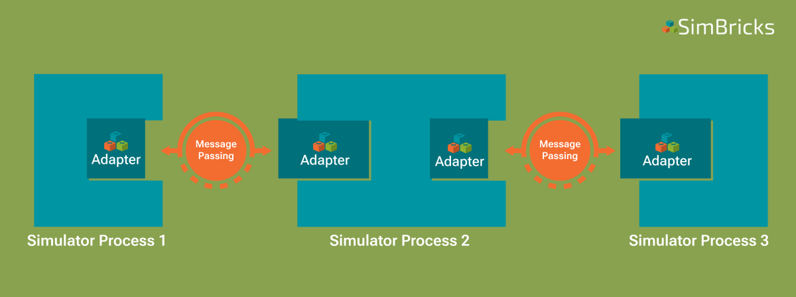

..
  Copyright 2022 Max Planck Institute for Software Systems, and
  National University of Singapore
..
  Permission is hereby granted, free of charge, to any person obtaining
  a copy of this software and associated documentation files (the
  "Software"), to deal in the Software without restriction, including
  without limitation the rights to use, copy, modify, merge, publish,
  distribute, sublicense, and/or sell copies of the Software, and to
  permit persons to whom the Software is furnished to do so, subject to
  the following conditions:
..
  The above copyright notice and this permission notice shall be
  included in all copies or substantial portions of the Software.
..
  THE SOFTWARE IS PROVIDED "AS IS", WITHOUT WARRANTY OF ANY KIND,
  EXPRESS OR IMPLIED, INCLUDING BUT NOT LIMITED TO THE WARRANTIES OF
  MERCHANTABILITY, FITNESS FOR A PARTICULAR PURPOSE AND NONINFRINGEMENT.
  IN NO EVENT SHALL THE AUTHORS OR COPYRIGHT HOLDERS BE LIABLE FOR ANY
  CLAIM, DAMAGES OR OTHER LIABILITY, WHETHER IN AN ACTION OF CONTRACT,
  TORT OR OTHERWISE, ARISING FROM, OUT OF OR IN CONNECTION WITH THE
  SOFTWARE OR THE USE OR OTHER DEALINGS IN THE SOFTWARE.

.. _sec-simulator-integration-background:

Background
==============================

We begin by introducing the high-level idea for connecting existing simulators. 

In a real physical systems, different components connect through common interfaces like PCIe or Ethernet. 
For example, a PCIe device can connect to any machine with PCIe, and a modern Ethernet device does not need to know what component it connects to.

We apply the same idea to creating virtual prototypes of complex systems: the structure of the virtual prototype corresponds to the structure of the simulated system,
and we interface different component simulators at natural interfaces for the physical system as shown in :numref:`overview-inkscape`.

Similarly to the real world do many existing simulators already expose an API for extending the simulation with components or devices that attach through these interfaces.
As a result, integrating a simulator into SimBricks only requires the developer to add Adapters for the specific interfaces, and to match these up with that simulator’s internal abstractions through the API they expose.
Hence, no complicated structural changes within an simulator are needed.
This reduces the complexity of integration as only compatibility with the SimBricks interface must be ensured, rather than with all other simulators.
Therefore, an adapter for a SimBricks interface only has to be implemented once when initially integrating the simulator.

.. _overview-inkscape:
.. figure:: overview-inkscape.svg
  :width: 800

  Schematic SimBricks virtual prototype composed of multiple simulators connected through Adapters at natural interface boundaries like PCIe and Ethernet.

SimBricks approach ensures modularity and the ability to flexibly combine simulators within a virtual prototype.
Adding Adapters at common interfaces means that you can swap out one simulator for another without having to change the adapter at the other side of the
connection under the assumption that the interface doesn’t change.

Additionally does SimBricks run individual component simulators as separate independent processes.
This makes the integration of independently implemented simulators (potentially using different programming languages and incompatible simulation modes)
easy as only the SimBricks interface has to be implemented correctly as part of a simulator.

Running component simulators as separate processes enables parallelism such that a virtual prototype with more components does require additional processor
resources but does not increase execution time significantly.

Two common examples for SimBricks interfaces are PCIe and Ethernet.
A PCIe device simulator can connect any simulator implementing the PCIe host interface.
Therefore, adding a PCIe adapter to a host simulator allows to connect to any other simulator that implements a device-side PCIe adapter. 

.. note::
    This approach does work for **closed-source simulators**, given they expose the necessary extensibility / API.

.. important::
    An important consideration when implementing the adapter is that, depending on the concrete interface, the two sides of a connection are not necessarily symmetric.
    
    This is for example the case when implementing a host-device PCIe interface within an adapter. 
    In the case of PCIe, the host can initiate BAR and PCIe config reads or writes. 
    The device, on the other hand, performs DMA and raises interrupts.

SimBricks Protocol
^^^^^^^^^^^^^^^^^^^^^^^^^^^^^^

The independent component simulator processes need to communicate.
The **SimBricks Protocol** defines the specifics of this interchange.

To retain loose coupling, we implement this through message-passing. 
That means the Adapters implementing a respectife interface as part of a simulator, communicate with each other through the exchange of messages as shown in :numref:`loosely-coupled-simulator-processes`.

.. _loosely-coupled-simulator-processes:

  Abstract view on a virtual prototype consisting of multiple simulator instances connected through SimBricks Adapters.

When creating virtual prototypes, simulators and therefore their respective Adapters, are always connected pair-wise. 
This pairwise message-passing between simulators ensures efficiency and scalability.

A single simulator can however have multiple Adapters, each connecting to an Adapter in another simulator. 
You can see this for example in the case of the network simulator in :numref:`overview-inkscape`.

The message-passing between Adapters is handled by optimized shared memory queues. 
Through such queues, adpaters exchange SimBricks protocol messages containing information about events in a FIFO manner.

From an Adapters point of view, there is **one queue sending messages and one queue for receiving messages**, respectively.

.. note::
    Therefore, when we say Adapters are always connected pair-wise the actual connecting consists of two shared memory queues. 
    One for sending SimBricks messages from Adapter A to Adapter B and another queue for the other direction.  

Having established these queues, each Adapter polls for messages on its respective receive queue.
This minimizes message transfer overhead and ensures fast simulation times as long as every simulator runs on its own physical CPU core.

**Interface-specific protocols** and thus the exchanged messages are defined on top of the SimBricks `Base protocol <https://github.com/simbricks/simbricks/blob/main/lib/simbricks/base/proto.h#L118-L131>`_.

The Base protocol stores two important fields at fixed offsets within the header (first 64 bytes) of each message:

* own_type - An integer identifying the message type, required to correctly interpret the message when processing it later.
* timestamp - Timestamp when the event occurred. Required when synchronizing to process the event at the correct time in the receiving simulator.

These fields **must not** be changed. Apart from that the header layout can be freely customized by the interface-specific protocol a user wants to implement. 
This includes the message size which is freely configurable per interface to accommodate payloads of different size.

Synchronization
^^^^^^^^^^^^^^^^^^^^^^^^^^^^^^

Once simulators can communicate at component interfaces to exchange data, we can create functionally correct and efficient virtual prototypes.
The performance measurements they produce are however not meaningful. 
The reason is that each simulator process has its local simulator clock advancing at an independent pace.
Therefore, **meaningful performance results require synchronized clocks** across all component simulators of a virtual prototype.

For this reason SimBricks offers two modes of operation, **unsynchronized and synchronized**.

.. warning::
    SimBricks default behavior is to execute virtual prototypes unsynchronized. 
    This mode of operation is meant purely for functional testing.

In unsynchronized mode, component simulators advance their virtual time as quickly as possible. 
This means that measurements taken on them are meaningless and cross-component measurements inaccurate but simulation times are generally faster.

The synchronized mode is meant for accurate measurements and has to be enabled when :ref:`configuring virtual prototypes <sec-orchestration-framework>`.

.. note::
    In case you are just interested in **functional** simulation, you can run the whole virtual testbed unsynchronized and skip this section.

To enable the synchronized execution of virtual prototypes, SimBricks messages are tagged with timestamps.
Communicating peer simulators synchronize with each other using these timestamps.
This is sufficient as correctness only requires that each simulator processes incoming messages at the correct time.

.. note::
    For meaningful performance results we do not need to synchronize simulators globally (for details check our `paper <https://www.simbricks.io/documents/22sigcomm_simbricks.pdf>`_).
    Instead it suffices to only perform pair-wise synchronization, i.e. we only sznchronize the clocks of simulators that are directly connected to each other.

A message with a particular timestamp is a promise that no older messages will arrive on that channel, and thus the simulator can safely advance to that time.
Therefore, the messages timestamps increase monotonically at the receiver side.
This mechanism is combined with the understanding that real-world component links always introduce some latency, which provides synchronization slack.
In essence, if one side of the connection polls a message with timestamp ``t``, it can safely proceed to ``t + link latency``.
In SimBricks virtual prototypes this link latency is :ref:`configured by the user <sec-orchestration-framework>`.

This latency can also be used to control the frequency of (dummy-) synchronization messages.
If a synchronization message with timestamp ``t`` has already been sent, another message is only necessary once the local clock reaches ``t + link`` latency.
This is because the connected simulator would not have processed any messages from the sender in the interim, due to the link latency.

.. note::
    Due to the above it is sufficient to send periodic synchronization messages with the link latency as the period. 
    Sending more messages for synchronization is equally valid does however harm performance.

Performing synchronization by using timestamps that are send along with messages incurs the risks of deadlocks in cases were no data messages are exchanged between simulators.
To prevent such deadlocks SimBricks employs dummy messages that carry a timestamp.
These messages are used for synchronization only and are used to ensure that connected peers can move forward in time even in cases were no data between Adapters is exchanged.