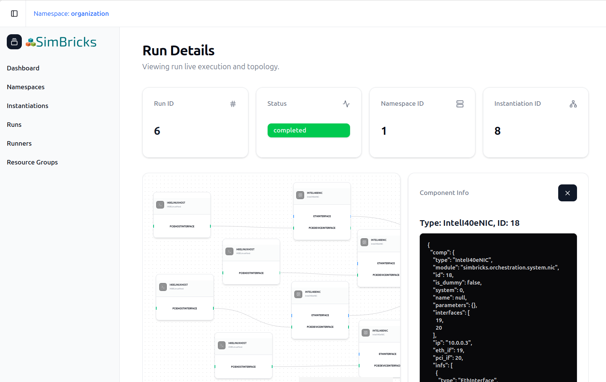

SimBricks Browser-Based UI
==========================

SimBricks Cloud platform features a proprietary browser-based graphical user
interface (UI).

  SimBricks web UI Run View.

This web interface serves as the central control plane for users interacting
with the SimBricks backend. It currently provides comprehensive, high-level
visibility into your simulation environments without needing to interact with
the raw Python API. 

Through the dashboard, users can seamlessly:

* **Investigate Virtual Prototypes:** Browse, manage, and verify the
  configurations of your VPs prior to execution.
* **Monitor Submitted Runs & System Instantiations:** Track the real-time status,
  scheduling, execution logs, specific topologies, and component linkages of
  virtual prototypes.
* **Manage Infrastructure & Runners:** View the fleet of active and non-active
  Runners, monitor node availability, and oversee resource sharing across your
  environment.
* **Organize Namespaces & Resource Groups:** Logically group simulation assets,
  manage resource allocations, and cleanly isolate different projects or teams
  within multi-tenant environments.

Whether your runs are executing on SimBricks-hosted infrastructure or your own
self-hosted runners, the web UI provides a unified pane of glass to manage your
entire virtual prototyping lifecycle.