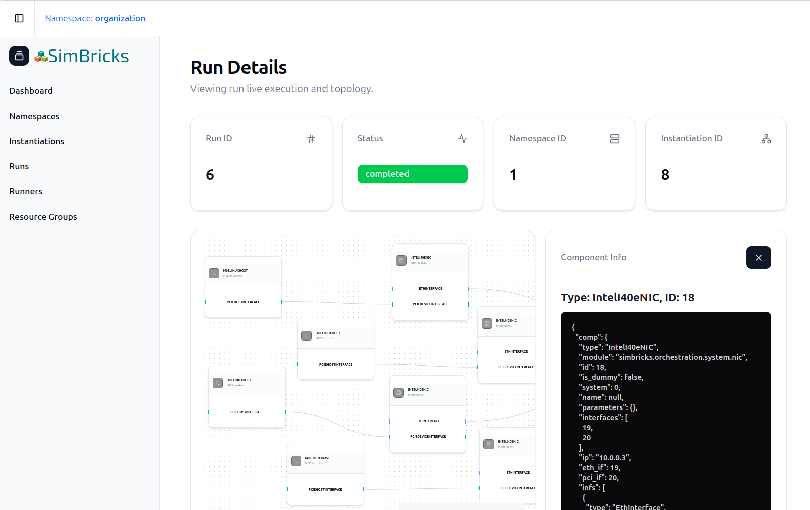

..
  Copyright 2026 Max Planck Institute for Software Systems,
  National University of Singapore, and SimBricks UG (haftungsbeschraenkt)
..
  Permission is hereby granted, free of charge, to any person obtaining
  a copy of this software and associated documentation files (the
  "Software"), to deal in the Software without restriction, including
  without limitation the rights to use, copy, modify, merge, publish,
  distribute, sublicense, and/or sell copies of the Software, and to
  permit persons to whom the Software is furnished to do so, subject to
  the following conditions:
..
  The above copyright notice and this permission notice shall be
  included in all copies or substantial portions of the Software.
..
  THE SOFTWARE IS PROVIDED "AS IS", WITHOUT WARRANTY OF ANY KIND,
  EXPRESS OR IMPLIED, INCLUDING BUT NOT LIMITED TO THE WARRANTIES OF
  MERCHANTABILITY, FITNESS FOR A PARTICULAR PURPOSE AND NONINFRINGEMENT.
  IN NO EVENT SHALL THE AUTHORS OR COPYRIGHT HOLDERS BE LIABLE FOR ANY
  CLAIM, DAMAGES OR OTHER LIABILITY, WHETHER IN AN ACTION OF CONTRACT,
  TORT OR OTHERWISE, ARISING FROM, OUT OF OR IN CONNECTION WITH THE
  SOFTWARE OR THE USE OR OTHER DEALINGS IN THE SOFTWARE.

.. _sec-web-ui:

SimBricks Browser-Based UI
==========================

SimBricks Cloud platform features a proprietary browser-based graphical user
interface (UI).

  SimBricks web UI Run View.

This web interface serves as the central control plane for users interacting
with the SimBricks backend. It currently provides comprehensive, high-level
visibility into your simulation environments without needing to interact with
the raw Python API.

Through the dashboard, users can seamlessly:

* **Investigate Virtual Prototypes:** Browse, manage, and verify the
  configurations of your VPs prior to execution.
* **Monitor Submitted Runs & System Instantiations:** Track the real-time status,
  scheduling, execution logs, specific topologies, and component linkages of
  virtual prototypes.
* **Manage Infrastructure & Runners:** View the fleet of active and non-active
  Runners, monitor node availability, and oversee resource sharing across your
  environment.
* **Organize Namespaces & Resource Groups:** Logically group simulation assets,
  manage resource allocations, and cleanly isolate different projects or teams
  within multi-tenant environments.

Whether your runs are executing on SimBricks-hosted infrastructure or your own
self-hosted runners, the web UI provides a unified pane of glass to manage your
entire virtual prototyping lifecycle.
