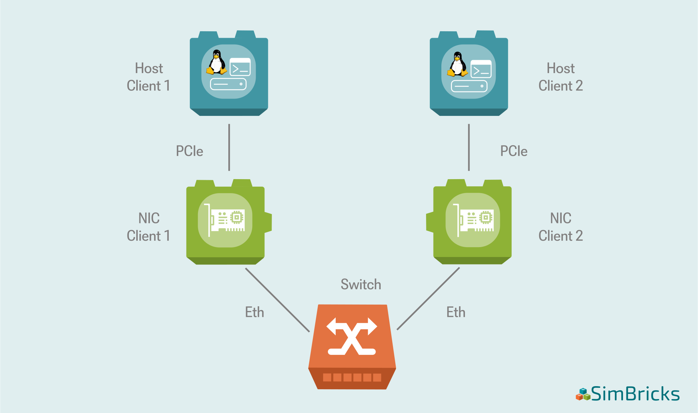

..
  Copyright 2021 Max Planck Institute for Software Systems, and
  National University of Singapore
..
  Permission is hereby granted, free of charge, to any person obtaining
  a copy of this software and associated documentation files (the
  "Software"), to deal in the Software without restriction, including
  without limitation the rights to use, copy, modify, merge, publish,
  distribute, sublicense, and/or sell copies of the Software, and to
  permit persons to whom the Software is furnished to do so, subject to
  the following conditions:
..
  The above copyright notice and this permission notice shall be
  included in all copies or substantial portions of the Software.
..
  THE SOFTWARE IS PROVIDED "AS IS", WITHOUT WARRANTY OF ANY KIND,
  EXPRESS OR IMPLIED, INCLUDING BUT NOT LIMITED TO THE WARRANTIES OF
  MERCHANTABILITY, FITNESS FOR A PARTICULAR PURPOSE AND NONINFRINGEMENT.
  IN NO EVENT SHALL THE AUTHORS OR COPYRIGHT HOLDERS BE LIABLE FOR ANY
  CLAIM, DAMAGES OR OTHER LIABILITY, WHETHER IN AN ACTION OF CONTRACT,
  TORT OR OTHERWISE, ARISING FROM, OUT OF OR IN CONNECTION WITH THE
  SOFTWARE OR THE USE OR OTHER DEALINGS IN THE SOFTWARE.

.. _chap-quickstart-sec-create-vp:

Create Your First Virtual Prototype
************************************************************************

.. hint::
  If you already created a virtual prototype, you can proceed by :ref:`executing your first virtual prototype <chap-quickstart-sec-executing-vp>`

To create our first virtual prototype we will make use of SimBricks :ref:`Orchestration Framework for configuring Virtual Prototypes <sec-orchestration-framework>` that simplifies 
the creation of virtual prototypes by providing a Python-based API with three intuitive abstraction layers: System Configuration, Simulation Configuration, and Instantiation Configuration.

We will now walk through each of those step by step and have a look at how they are used to create your first virtual prototype.

In this section we will walk you through the ``my-simple-experiment.py`` virtual prototype configuration script from our examples repository.

.. tip::
  You can find the complete script `here <https://github.com/simbricks/simbricks-examples/blob/main/first-steps/my-simple-experiment.py>`_ 

Define the System Configuration
===================================

The System Configuration lays the groundwork by defining the structure of your virtual prototype.
This includes specifying components like hosts, network interfaces (NICs), switches, and the channels that connect them.

.. _chap-quickstart-sec-create-vp-fig-topo:

  Topology of the Virtual Prototype created in this example.

In this example we will set up a simple virtual prototype that is composed of two hosts that are each connected to a network
interface card (NIC). Those NICs are then respectively connected to an ethernet switch. 
A schematic representation of that topology is shown in :numref:`chap-quickstart-sec-create-vp-fig-topo` .

The hosts will run Linux with the its regular network stack.
One of the hosts will act as a client whereas the other will act as server. 
The client will ping the server.

We start by configuring the system from which we want to create a virtual prototype of.
That means specifying **what we want to simulate** instead of making a choice on how (i.e. which simulator to use) to simulate it.
This is the usual way to start a SimBricks script.

- The first step is to create an System object.
  This object contains pointers to all relevant Components of the system we want to simulate.
  Later on we will use those Components and decide for each which simulator we want to use.

  .. code-block:: python
    
    from simbricks.orchestration import system
    
    syst = system.System()

- Next we want to add a a host specification for our client to the system.
  In this case we create Linux host that is supposed to have the driver for the IntelI40E nic available.
  (Implicitly the Linux Host Component is added to our previously created System obect through its constructor) 
  
  Then we add two disk images. 
  The DistroDiskImage is one of the linux images distributed alongside SimBricks that contains the required driver.
  The LinuxConfigDiskImage will later on store the actual commands that we want to execute during the simulation on this host.

  .. code-block:: python

    host0 = system.I40ELinuxHost(syst)
    host0.add_disk(system.DistroDiskImage(h=host0, name="base"))
    host0.add_disk(system.LinuxConfigDiskImage(h=host0))

- After configuring the client host, we create a specification for an Intel i40e NIC.
  This Component should connect to the host through a PCIe interface.
  
  Under the hood, SimBricks System Configurations use a notion of device interfaces that are connected through a Channel.
  Similar to the real world, we further assign an IP address to the NIC.
  This Ip address will be made accessible to the host when connecting the NICs interface to the host.

  .. code-block:: python

    nic0 = system.IntelI40eNIC(syst)
    nic0.add_ipv4("10.0.0.1")
    host0.connect_pcie_dev(nic0)

- Similar to the client, we create a server and attach a nic to the server.

  .. code-block:: python

    host1 = system.I40ELinuxHost(syst)
    host1.add_disk(system.DistroDiskImage(h=host1, name="base"))
    host1.add_disk(system.LinuxConfigDiskImage(h=host1))

    nic1 = system.IntelI40eNIC(syst)
    nic1.add_ipv4("10.0.0.2")
    host1.connect_pcie_dev(nic1)

- Once we created and connected the NIC to our client host, we specify the application to run during the simulation.

  In the case of our client we simply choose to send pings to the server.
  For that we pass the server NICs IP address to the application such that it knows where to send those pings to.
  
  Further we specify the wait flag on that application.
  The wait flag is important to tell SimBricks to wait until this application ran to completion until SimBricks can stop teh excution and cleanup.

  .. code-block:: python

    client_app = system.PingClient(host0, nic1._ip)
    client_app.wait = True
    host0.add_app(client_app)
    
- Again, similar to the client case, we create an application and assign it to the server host we created before.
  In this case the server is supposed to not actively start anything. Its purpose will simply be to answer the pings send by the client.

  Note that we do not need to specify the wait flag in this case, as we are interested in the client application to finish, not the server one.

  .. code-block:: python

    server_app = system.Sleep(host1, infinite=True)
    host1.add_app(server_app)

- Once we specified the client and server host/NICs we want to simulate, we create a configuration for an ethernet switch.
  
  The switch should connect to the ethernet interfaces of the previously created NICs in order to connect those with each other like in a real network.

  .. code-block:: python

    switch = system.EthSwitch(syst)
    switch.connect_eth_peer_if(nic0._eth_if)
    switch.connect_eth_peer_if(nic1._eth_if)

And that's it! We have assembled our first SimBricks System Configuration. We continue with the Simulation Configuration.

Set Up the Simulation Configuration
===================================

In the previoius step we configured the system that we want to simulate.
After we did this we now have to make a choice on what simulators we want to use to simulate this system.

The Simulation Configuration is used to make this simulator choice and assigns a simulator to the Components defined in the System Configuration.
For instance, a NIC can be simulated by a behavioral or RTL simulator, while a host might use QEMU or Gem5.

The next step in our SimBricks script makes this choice:

- The first step is to create a Simulation object.

  .. code-block:: python

    from simbricks.orchestration import simulation
    from simbricks.orchestration.helpers import simulation as sim_helpers

    sim = simulation.Simulation(name="My-simple-simulation", system=syst)

- After that we assign each system Component that we created before (i.e. the two hosts, the two nics and the switch) to an simulator instance.
  When making this assignment each system Components added to a simulator python instance that is during execution supposed to simulate that Component.

  To make this easier, we use a SimBricks helper function that uses a map which defines the Component to simulator mapping.
  Internally the function will iterate over the Systems Components, look the desired simulator type up in the provided mapping, create the simulator instance and add the Component to that instance. 

  .. code-block:: python

    sim = sim_helpers.simple_simulation(
        syst,
        compmap={
            system.FullSystemHost: simulation.QemuSim,
            system.IntelI40eNIC: simulation.I40eNicSim,
            system.EthSwitch: simulation.SwitchNet,
        },
    )

That's it, we made a choice on how to simulate the System we configured.

Configuring the Instantiation
===================================

The last thing we need to take care of in order to simulate our virtual prototype is to create an Instantiation Configuration for it.

Through the Instantiation Configuration, users can configure where and how the virtual prototype is executed.
Therefore, it is used to specify :ref:`Runners <sec-architecture>` that execute the virtual prototype and whether it shall be executed in a distributed fashion by multiple Runners.

- In our example we create a very simple Instantiation and assign the previously created Simulation object to it.

  .. code-block:: python
  
    from simbricks.orchestration import instantiation
    
    instance = instantiation.Instantiation(sim)

- Before we are done, we need to create a single runtime Fragement. To this Fragment we will add all simulators that we created before.
  
  Through this we specify that we intend to execute all our simulators of our virtual prototype as part of the same Fragment.
  That means we do not distribute the execution of our virtual prototype across multiple Runners.

  .. code-block:: python

    fragment = instantiation.Fragment()
    fragment.add_simulators(*sim.all_simulators())
    instance.fragments = [fragment]

- The last thing we do is to define a list of Instantiations to which we add the one we just created.
  This list is used when submitting our script to the SimBricks Backend thourh the CLI.
  
  .. code-block:: python

    instantiations = []
    instantiations.append(instance)

And that's it! We have assembled our first SimBricks virtual prototype and we are ready for execution.