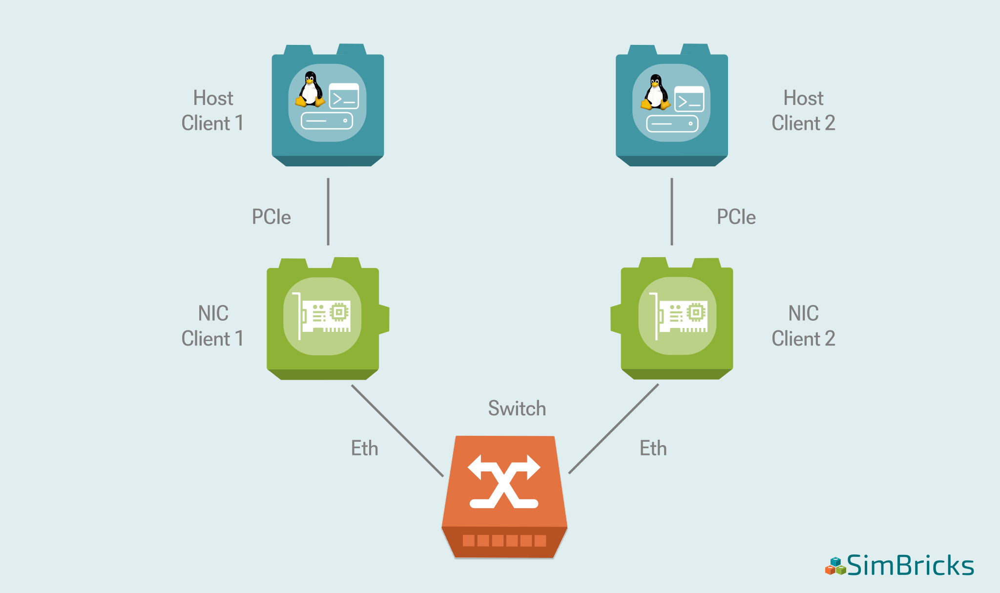

..
  Copyright 2026 Max Planck Institute for Software Systems,
  National University of Singapore, and SimBricks UG (haftungsbeschraenkt)
..
  Permission is hereby granted, free of charge, to any person obtaining
  a copy of this software and associated documentation files (the
  "Software"), to deal in the Software without restriction, including
  without limitation the rights to use, copy, modify, merge, publish,
  distribute, sublicense, and/or sell copies of the Software, and to
  permit persons to whom the Software is furnished to do so, subject to
  the following conditions:
..
  The above copyright notice and this permission notice shall be
  included in all copies or substantial portions of the Software.
..
  THE SOFTWARE IS PROVIDED "AS IS", WITHOUT WARRANTY OF ANY KIND,
  EXPRESS OR IMPLIED, INCLUDING BUT NOT LIMITED TO THE WARRANTIES OF
  MERCHANTABILITY, FITNESS FOR A PARTICULAR PURPOSE AND NONINFRINGEMENT.
  IN NO EVENT SHALL THE AUTHORS OR COPYRIGHT HOLDERS BE LIABLE FOR ANY
  CLAIM, DAMAGES OR OTHER LIABILITY, WHETHER IN AN ACTION OF CONTRACT,
  TORT OR OTHERWISE, ARISING FROM, OUT OF OR IN CONNECTION WITH THE
  SOFTWARE OR THE USE OR OTHER DEALINGS IN THE SOFTWARE.

.. _chap-quickstart-sec-create-vp:

Create Your First Virtual Prototype
************************************************************************

.. hint::
  If you already created a virtual prototype, you can proceed by :ref:`executing your first virtual prototype <chap-quickstart-sec-executing-vp>`

To create our first virtual prototype we will make use of SimBricks' :ref:`Orchestration Framework for configuring Virtual Prototypes <sec-orchestration-framework>` that simplifies
the creation of virtual prototypes by providing a Python-based API with three intuitive abstraction layers: System Configuration, Simulation Configuration, and Instantiation Configuration.

We will now walk through each of those step by step and have a look at how they are used to create your first virtual prototype.

In this section we will walk you through the ``my-simple-experiment.py`` virtual prototype configuration script from our examples repository.

.. tip::
  You can find the complete script `here <https://github.com/simbricks/simbricks-examples/blob/main/first-steps/my-simple-experiment.py>`_

Before we start, one thing to know about imports: the *generic* building blocks (hosts, NICs,
switches, disk images, applications, channels) come from the ``simbricks-orchestration`` package,
i.e. ``simbricks.orchestration.*``. The *concrete* device models and simulators each come from
their own component package under the shared ``simbricks.components.*`` namespace — in this example
we use the Intel i40e NIC model (``simbricks-i40e-sys-py`` / ``simbricks-i40e-sim-bm-py``), the
QEMU host simulator (``simbricks-qemu-sim-py``), and the basic network simulators
(``simbricks-net-base-sim-py``). The script therefore starts with the following imports:

.. code-block:: python

  from simbricks.orchestration import system
  from simbricks.components.i40e import system as i40e_sys
  from simbricks.components.qemu import simulation as qemu_sim
  from simbricks.components.net.simulation import base as net_sim
  from simbricks.components.i40e.simulation import behavioral as i40e_sim
  from simbricks.orchestration.helpers import simulation as sim_helpers
  from simbricks.orchestration.helpers import instantiation as inst_helpers

Define the System Configuration
===================================

The System Configuration lays the groundwork by defining the structure of your virtual prototype.
This includes specifying components like hosts, network interfaces (NICs), switches, and the channels that connect them.

.. _chap-quickstart-sec-create-vp-fig-topo:

  Topology of the Virtual Prototype created in this example.

In this example we will set up a simple virtual prototype that is composed of two hosts that are each connected to a network
interface card (NIC). Those NICs are then respectively connected to an ethernet switch.
A schematic representation of that topology is shown in :numref:`chap-quickstart-sec-create-vp-fig-topo` .

The hosts will run Linux with its regular network stack.
One of the hosts will act as a client whereas the other will act as server.
The client will run an iperf TCP benchmark against the server.

We start by configuring the system from which we want to create a virtual prototype of.
That means specifying **what we want to simulate** instead of making a choice on how (i.e. which simulator to use) to simulate it.
This is the usual way to start a SimBricks script.

- The first step is to create a System object.
  This object contains pointers to all relevant Components of the system we want to simulate.
  Later on we will use those Components and decide for each which simulator we want to use.

  .. code-block:: python

    syst = system.System()

- Next, we create a disk image object for our hosts.
  The ``DistroDiskImage`` refers to one of the Linux images distributed alongside SimBricks
  (built with the :image-builder:`\ ` tool) by name. The image named ``base`` contains the required
  drivers for the devices we simulate here. Note that the disk image is created once on the
  ``System`` and can then be added to multiple hosts.

  .. code-block:: python

    distro_disk_image = system.DistroDiskImage(syst, "base")

- Now we add a host specification for our client to the system.
  In this case we create a Linux host that is supposed to have the driver for the Intel i40e NIC
  available, so we use the ``I40ELinuxHost`` component from the i40e component package.
  (Implicitly the Linux Host Component is added to our previously created System object through its constructor.)

  Then we add two disk images: the ``base`` distro image we just created, and a
  ``LinuxConfigDiskImage``, which will later on store the actual commands that we want to execute
  during the simulation on this host. Note that the ``LinuxConfigDiskImage`` takes the ``System``
  as its first and the host it belongs to as its second argument.

  .. code-block:: python

    host0 = i40e_sys.I40ELinuxHost(syst)
    host0.add_disk(distro_disk_image)
    host0.add_disk(system.LinuxConfigDiskImage(syst, host0))

- After configuring the client host, we create a specification for an Intel i40e NIC.
  This Component should connect to the host through a PCIe interface.

  Under the hood, SimBricks System Configurations use a notion of device interfaces that are connected through a Channel.
  Similar to the real world, we further assign an IP address to the NIC.
  This IP address will be made accessible to the host when connecting the NIC's interface to the host.

  .. code-block:: python

    nic0 = i40e_sys.IntelI40eNIC(syst)
    nic0.add_ipv4("10.0.0.1")
    host0.connect_pcie_dev(nic0)

- Similar to the client, we create a server and attach a NIC to the server.

  .. code-block:: python

    host1 = i40e_sys.I40ELinuxHost(syst)
    host1.add_disk(distro_disk_image)
    host1.add_disk(system.LinuxConfigDiskImage(syst, host1))

    nic1 = i40e_sys.IntelI40eNIC(syst)
    nic1.add_ipv4("10.0.0.2")
    host1.connect_pcie_dev(nic1)

- Once we created and connected the NICs to our hosts, we specify the applications to run during the simulation.

  In the case of our client we choose to run an iperf TCP client that connects to the server.
  For that we pass the server NIC's IP address to the application such that it knows where to connect to.

  Further we specify the wait flag on that application.
  The wait flag is important to tell SimBricks to wait until this application ran to completion before SimBricks can stop the execution and clean up.

  .. code-block:: python

    client_app = system.IperfTCPClient(h=host0, server_ip=nic1._ip)
    client_app.wait = True
    host0.add_app(client_app)

- Again, similar to the client case, we create an application and assign it to the server host we created before.
  In this case the server runs an iperf TCP server that simply answers the requests sent by the client.

  Note that we do not need to specify the wait flag in this case, as we are interested in the client application to finish, not the server one.

  .. code-block:: python

    server_app = system.IperfTCPServer(h=host1)
    host1.add_app(server_app)

- Once we specified the client and server hosts/NICs we want to simulate, we create a configuration for an ethernet switch.

  The switch should connect to the ethernet interfaces of the previously created NICs in order to connect those with each other like in a real network.

  .. code-block:: python

    switch = system.EthSwitch(syst)
    switch.connect_eth_peer_if(nic0._eth_if)
    switch.connect_eth_peer_if(nic1._eth_if)

And that's it! We have assembled our first SimBricks System Configuration. We continue with the Simulation Configuration.

Set Up the Simulation Configuration
===================================

In the previous step we configured the system that we want to simulate.
After we did this we now have to make a choice on what simulators we want to use to simulate this system.

The Simulation Configuration is used to make this simulator choice and assigns a simulator to the Components defined in the System Configuration.
For instance, a NIC can be simulated by a behavioral or RTL simulator, while a host might use QEMU or gem5.
The simulator classes come from the respective component packages: ``QemuSim`` from
``simbricks.components.qemu.simulation``, ``I40eNicSim`` (the i40e behavioral model) from
``simbricks.components.i40e.simulation.behavioral``, and ``SwitchNet`` (a simple behavioral
Ethernet switch) from ``simbricks.components.net.simulation.base``.

To make the assignment easier, we use a SimBricks helper function that uses a map which defines the Component-to-simulator mapping.
Internally, the function will create a ``Simulation`` object, iterate over the System's Components, look the desired simulator type up in the provided mapping, create the simulator instance, and add the Component to that instance.

.. code-block:: python

  sim = sim_helpers.simple_simulation(
      syst,
      compmap={
          system.FullSystemHost: qemu_sim.QemuSim,
          i40e_sys.IntelI40eNIC: i40e_sim.I40eNicSim,
          system.EthSwitch: net_sim.SwitchNet,
      },
  )

That's it, we made a choice on how to simulate the System we configured.

.. tip::
  If you want to see what the helper does under the hood — explicitly creating a
  ``simulation.Simulation(name=..., system=syst)`` object and one simulator instance per component
  — have a look at
  `my-simple-experiment-verbose.py <https://github.com/simbricks/simbricks-examples/blob/main/first-steps/my-simple-experiment-verbose.py>`_
  in the examples repository.

Configuring the Instantiation
===================================

The last thing we need to take care of in order to simulate our virtual prototype is to create an Instantiation Configuration for it.

Through the Instantiation Configuration, users can configure where and how the virtual prototype is executed.
Therefore, it is used to specify :ref:`Runners <sec-runner>` that execute the virtual prototype and whether it shall be executed in a distributed fashion by multiple Runners.

- In our example we create a very simple Instantiation with the help of another SimBricks helper function.
  The helper assigns the previously created Simulation object to a new Instantiation, creates a
  single runtime Fragment, and adds all simulators to it.
  A Fragment is the unit of execution: all simulators within one Fragment are executed together on
  the same Runner. Since we add all simulators to a single Fragment, our virtual prototype is not
  distributed across multiple Runners.

  .. code-block:: python

    instance = inst_helpers.simple_instantiation(sim)

  This is equivalent to the following explicit code:

  .. code-block:: python

    from simbricks.orchestration import instantiation

    instance = instantiation.Instantiation(sim)
    fragment = instantiation.Fragment()
    fragment.add_simulators(*sim.all_simulators())
    instance.fragments = [fragment]

- The last thing we do is to define a list of Instantiations to which we add the one we just created.
  This list is used when submitting our script to the SimBricks Backend through the CLI: SimBricks
  expects every virtual prototype script to define a module-level list called ``instantiations``.

  .. code-block:: python

    instantiations = []
    instantiations.append(instance)

And that's it! We have assembled our first SimBricks virtual prototype and we are ready for execution.
